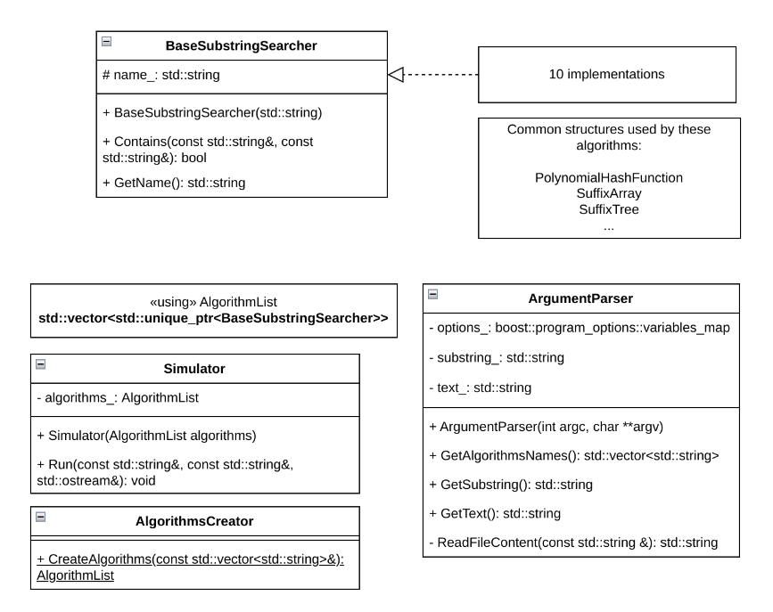

# Архитектура библиотеки и среды исполнения

Пользователь запускает программу с аргументами командной строки.\
Создается объект `ArgumentParser`, который разбирает аргументы командной строки.\
Вызывается метод `GetAlgorithmsNames` класса `ArgumentParser`, который возвращает вектор названий алгоритмов.\
Вектор названий передается в метод `CreateAlgorithms` класса `AlgorithmsCreator`, который создает и возвращает вектор объектов алгоритмов.\
Вызывается метод `GetSubstring` класса `ArgumentParser`, который возвращает подстроку для поиска.\
Вызывается метод `GetText` класса `ArgumentParser`, который возвращает текст, в котором будет производиться поиск.\
Вектор алгоритмов передается в конструктор `Simulator`.\
Вызывается метод `Run`, принимающий искомую подстроку, класса `Simulator`.

Для каждого алгоритма в векторе `algorithms_`:
- Вызывается метод `Contains` для поиска подстроки.
- Результаты (время выполнения, успешность поиска) записываются.
- Результаты сравниваются и выводятся пользователю.

Некоторые алгоритмы могут использовать общие структуры данных, такие как `PolynomialHashFunction`, `SuffixArray` или `SuffixTree`. Эти структуры создаются и управляются внутри соответствующих алгоритмов.

### Список реализованных алгоритмов
- Наивный алгоритм (`brute-force`)
- Поиск подстроки в строке с помощью Z-функции (`Z-algorithm`)
- Алгоритм Рабина-Карпа (`Rabin-Karp`)
- Алгоритм Кнута-Морриса-Пратта (`KMP`)
- Алгоритм Shift-Or (`shift-or`)
- Алгоритм Ахо-Корасик (`Aho-Corasick`)
