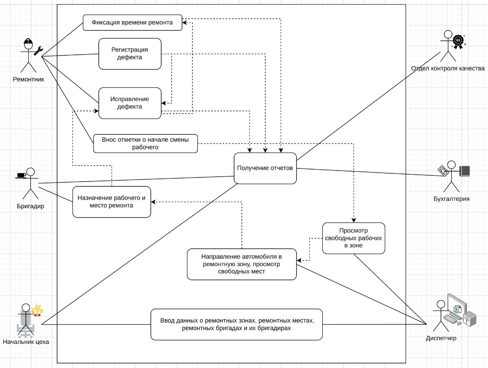
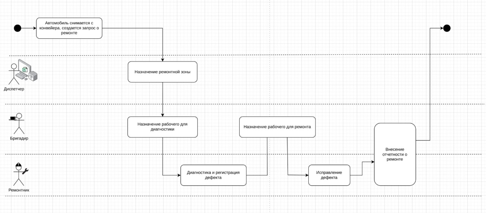
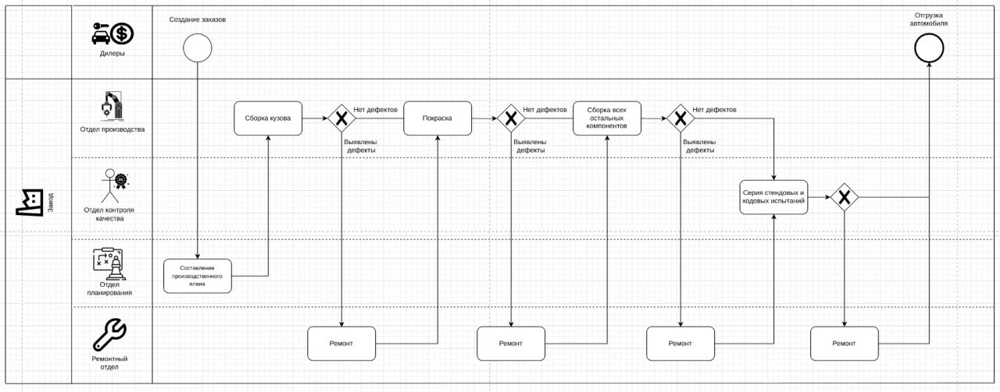

## Диаграмма случаев использования

*Диаграмма описывает пользователей и случаи использования разрабатываемого приложения.*

## Диаграмма активностей

*Диаграмма активностей для основного бизнес-процесса — регистрации и ремонта дефекта.*

## BPMN-диаграмма

*BPMN-диаграмма всего бизнес-процесса завода, включая внешних участников.*